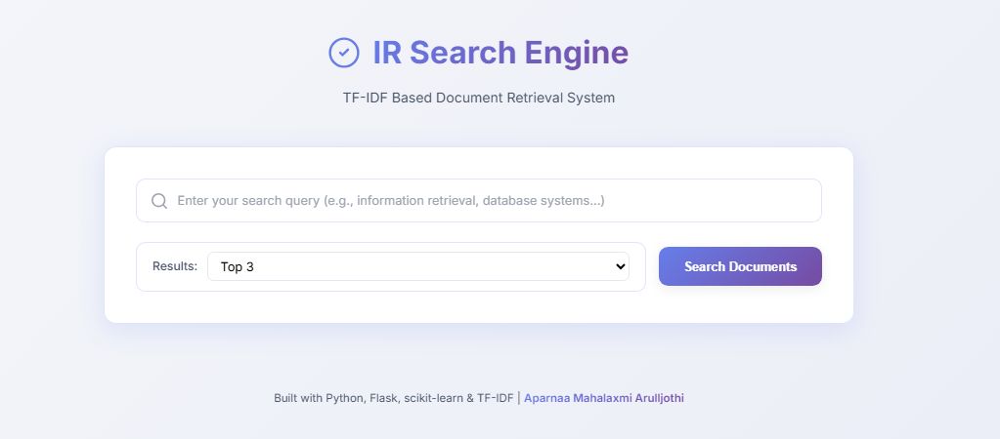
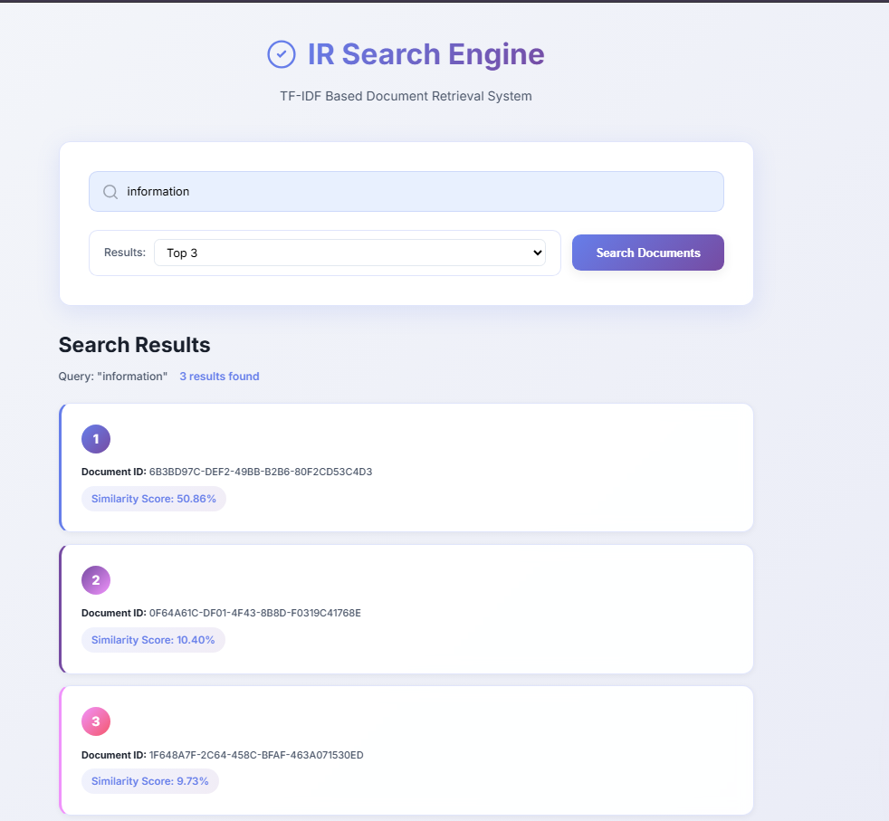

# Information Retrieval Search Engine

 The project demonstrates an end-to-end search pipeline including web crawling, text extraction, TF–IDF indexing, query ranking, and a REST API for interactive search.

## Project Overview

The system implements:
- Web crawling (Scrapy)
- HTML text extraction and preprocessing
- TF–IDF vector space model using scikit-learn
- Query ranking with cosine similarity
- REST API (Flask) for real-time search
- CSV-based offline query processing

---

## Directory Structure
```
project/
│── api/
│   ├── static/css/style.css
│   ├── static/js/script.js
│   ├── templates/
│   └── app.py
│
│── data/
│   ├── html_corpus/
│   ├── wiki_corpus/
│   ├── output/
│   │   ├── index.json
│   │   ├── wiki_index.json
│   │   └── results.csv
│
│── notebooks/
│── src/
│   ├── crawler.py
│   ├── indexer.py
│   ├── query_processor.py
│   ├── similarity.py
│   └── utils.py
│
│── tests/
│   ├── queries.csv
│   └── test_system.py
│
│── build_wiki_index.py
│── requirements.txt
│── run_pipeline.py
```

---

## Installation
```bash
pip install -r requirements.txt
```
##  Screenshots
**Front Page**  


**results**  



---

## 1. Crawling the Web Corpus

Run the crawler:
```bash
python src/crawler.py
```

This generates a folder:
```
data/wiki_corpus/
```

containing raw HTML pages crawled from Wikipedia.

---

## 2. Text Extraction & Preprocessing

HTML pages are cleaned using BeautifulSoup:
- Removes `script`, `style`, `meta`, `link`
- Normalizes whitespace
- Returns plain text for indexing

Implementation in `utils.py`.

---

## 3. TF–IDF Indexing

### Official HTML Corpus Index

Run:
```bash
python src/indexer.py
```

Creates:
```
data/output/index.json
```

### Wikipedia Corpus Index

Run:
```bash
python build_wiki_index.py
```

Creates:
```
data/output/wiki_index.json
```

Both JSON files contain:
- `document_ids`
- `vocabulary`
- `tfidf_matrix`
- Vectorizer parameters

---

## 4. Query Processing

Offline query processing:
```bash
python src/query_processor.py
```

Reads:
- `index.json`
- `tests/queries.csv`

Outputs ranked results:
```
data/output/results.csv
```

---

## 5. REST API (Flask)

Launch the API:
```bash
python api/app.py
```

Visit:
```
http://localhost:5000
```

### POST `/search` Example

Input:
```json
{
  "query": "information retrieval system",
  "top_k": 3
}
```

Output:
```json
{
  "results": [
    {"document_id": "doc1", "rank": 1, "score": },
    {"document_id": "doc3", "rank": 2, "score": },
    {"document_id": "doc2", "rank": 3, "score": }
  ]
}
```

---

## 6. Tests

Run automated tests:
```bash
pytest
```

---

## Expected Outputs

After running the pipeline you should have:
```
data/output/index.json
data/output/wiki_index.json
data/output/results.csv
data/wiki_corpus/
```
---

## Acknowledgements

Developed for the Information Retrieval course taught by Prof. Jawahar Panchal.